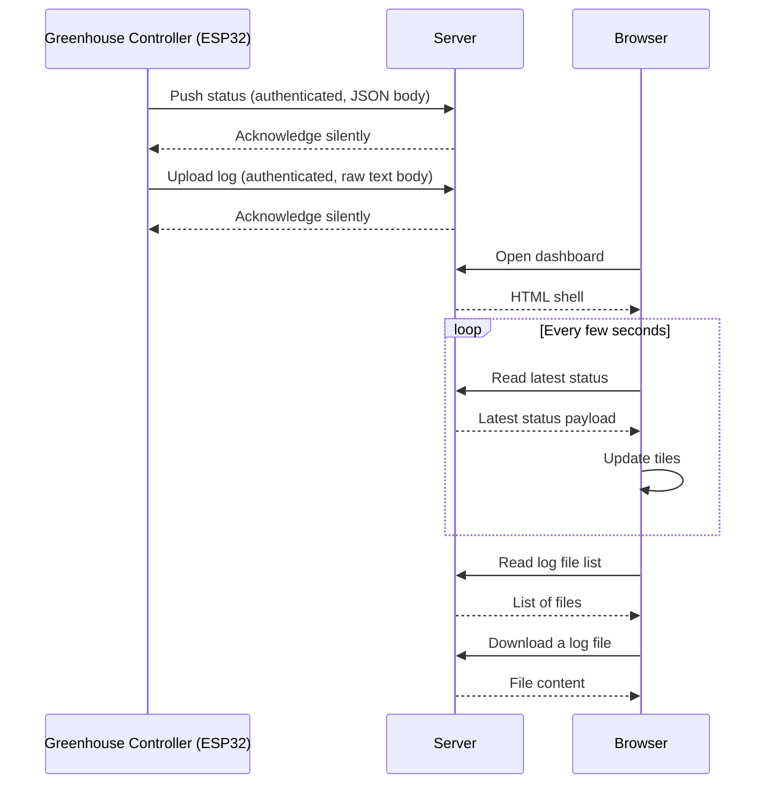

# Greenhouse Controller Status Website — Functional Design

| | |
|---|---|
| Document | Functional Design |
| Audience | Stakeholders, reviewers, anyone who needs to understand *what* the system does |
| Companion | [technical-spec.md](technical-spec.md) — *how* it is built |
| Version | 0.2 (draft) |
| Date | 2026-05-10 |
| Status | For review |
| Companion controller | greenhouse-Controller (ESP32-S3 firmware, separate repository) |

This document describes externally-observable behavior, contracts, and rules. It does not prescribe code, file paths, function names, or specific syntax — those live in the [technical specification](technical-spec.md).

## Table of contents

1. [Purpose and scope](#1-purpose-and-scope)
2. [System context](#2-system-context)
3. [Components](#3-components)
4. [API contract](#4-api-contract)
5. [Status JSON schema](#5-status-json-schema)
6. [Dashboard behavior](#6-dashboard-behavior)
7. [Tile catalogue](#7-tile-catalogue)
8. [Freshness tile](#8-freshness-tile)
9. [Windows tile](#9-windows-tile)
10. [Mobile-first UI rules](#10-mobile-first-ui-rules)
11. [Security policy](#11-security-policy)
12. [Error handling policy](#12-error-handling-policy)
13. [Future extensions (out of scope)](#13-future-extensions-out-of-scope)
14. [Testable requirements](#14-testable-requirements)
15. [Appendix A — Status JSON schema reference](#appendix-a--status-json-schema-reference)
16. [Appendix B — Decoded mode flags](#appendix-b--decoded-mode-flags)

---

## 1. Purpose and scope

The website is a **mobile-first, passive viewer** for one ESP32-S3 greenhouse controller. The controller pushes its current status (sensors, vent positions, mode) and uploads its event log over an HTTP REST API. The website stores the latest payload and renders a tiled dashboard. It also lists log files for download.

**In scope**

- Receive status updates from one greenhouse controller and display them.
- Receive log files from the controller and offer them for download.
- Render correctly on a 360 px-wide phone in portrait.
- Indicate at all times whether the controller is still reporting on schedule.

**Out of scope**

- Any command flow back to the controller. The website is read-only with respect to the greenhouse.
- Multi-tenant or multi-controller support. Exactly one controller is assumed.
- Historical charting or trending. Only the latest status is kept.
- User accounts. The dashboard is publicly viewable; only the controller-to-server write path is secret-gated.
- Push notifications, WebSockets, or Server-Sent Events. The browser polls.

---

## 2. System context



The browser **never** sees or transmits the shared secret used between the controller and the server. The controller-write path and the browser-read path are kept on physically separate API surfaces so each can be hardened independently.

---

## 3. Components

| Component | Role | Trust |
|---|---|---|
| **Public dashboard** | The HTML page served to anyone who visits the site. | Public. |
| **Controller ingest API** | Single endpoint for the controller to push status and upload logs. Authenticated by a shared secret carried in an HTTP header. Accepts only writes. | Trusted (controller ↔ server). |
| **Browser read API** | Single endpoint the dashboard polls for the latest status and the log file list. Read-only. Hardened separately from the ingest API. | Public read. |
| **Log download** | Static read-only directory. Files are served by the web server, not by application code. | Public read, filename-whitelisted. |

The ingest API and the read API are deliberately separate so the read API's policies (rate limit, optional Basic Auth, IP allowlist, CORS, cache headers) can change without affecting the controller's write path, and vice versa.

---

## 4. API contract

### 4.1 Operations

| Operation | Direction | Authenticated | Effect |
|---|---|---|---|
| Push status | Controller → server | Yes (shared secret) | Server replaces the latest stored status with the new payload. |
| Upload log | Controller → server | Yes (shared secret) | Server stores the file under a server-generated, timestamped name. Server prunes log files older than the retention window. |
| Read status | Browser → server | No | Server returns the latest stored status, with the time elapsed since it was received. If no status has ever been received, server returns an empty payload. |
| List logs | Browser → server | No | Server returns the available log files, newest first. |
| Download log | Browser → server | No | Server returns the file content. Filenames are restricted to a strict pattern. |

### 4.2 Authentication and silent-drop behavior

The shared secret defends the controller-write path only. The read path is publicly readable by design — the dashboard is itself public.

The controller-write path follows a **silent-drop** behavior: any failed authentication, malformed body, or invalid request is acknowledged with an empty success-shaped response and no error detail. This prevents internet-wide probing from learning anything useful. A configurable debug mode reverses this behavior: errors are returned verbosely so the controller integration can be diagnosed during commissioning.

The read path always returns a useful body; the browser depends on it to render the dashboard.

### 4.3 Browser-API hardening

Because the read path is its own surface, the following policies can be applied to it without touching the controller:

- Cache-control headers to keep the dashboard always fresh.
- Optional rate limit per client IP if abuse is observed.
- Optional HTTP Basic Auth or IP allowlist if dashboard access ever needs to be private.
- Optional CORS allowance if a third-party viewer is ever introduced.

None of these are required in v1. They are listed as future-proofing so the read path can evolve independently.

---

## 5. Status JSON schema

The controller decides which top-level objects to include in each push.

- A missing top-level object causes the corresponding tile to **hide** (with one always-visible exception, § 8).
- A missing key inside a present object causes that single line within the tile to be omitted.
- There are no "N/A" placeholders. Existence in the payload corresponds directly to display on the dashboard.

This gives the controller direct presence-to-display control without the website needing per-feature flags.

The full schema is in [Appendix A](#appendix-a--status-json-schema-reference).

One field is required at the top level: `update_interval_s` — the controller's configured update cadence in seconds. The freshness tile (§ 8) uses it to decide when the dashboard is stale.

---

## 6. Dashboard behavior

### 6.1 Polling

The dashboard polls the read API on a fixed schedule (default 5 seconds) and re-renders every visible tile from the latest payload.

### 6.2 Tile show/hide

A tile is shown if and only if its top-level object is present in the latest payload. Within a visible tile, each line is shown if and only if its key is present.

Exception: the **freshness tile** (§ 8) is always visible. It is the heartbeat indicator and must remain on screen even when the server has never received a payload — an empty dashboard must not look healthy.

### 6.3 Staleness

The freshness tile (§ 8) is the authority on staleness. When its state crosses into the "fully stale" range, the rest of the dashboard dims to indicate that no tile content is recent. The freshness tile itself stays at full brightness so the user can see why everything else is dimmed.

The browser does not poll faster when stale; the controller drives cadence.

---

## 7. Tile catalogue

| Tile | Show when | What it shows |
|---|---|---|
| Freshness | always | Countdown progress bar coloured by age; last-update timestamp; configured update interval; current age. (See § 8.) |
| Climate | `climate` object present | Temperature in °C and relative humidity in %, each on its own line. Under each value, a smaller non-bold setpoint sub-line: T-max for temperature; min / max for RH. The RH sub-line is dimmed (em-dashes shown) when `climate.rh_ctrl_enabled` is `false`. |
| Wind | `wind` object present | Wind speed in m/s and direction in degrees with the 8-point cardinal label (N, NE, E, SE, S, SW, W, NW), on two separate lines. |
| Windows | `windows` object present | Three coloured bars representing M1, M2, and M3 in plan view. (See § 9.) |
| Mode | `mode` object present | The current mode as a pill label, plus one badge per active mode flag. Flags that duplicate the current mode (`wind_override` ↔ `WIND_OVERRIDE`, `calibrating` ↔ `WINDOW_CAL`, `motor_alarm` ↔ `MOTOR_ALARM`) are suppressed so each state surfaces exactly once. |
| Daytime | `sun` object present | Day/night indicator (☀ / ☾); sunrise and sunset times (controller local time). (Internal id remains `tile-sun`; the heading was renamed from "Sun" → "Daylight" → "Daytime" during the 2026-05-10 UI iteration.) |
| System | `system` object present | WiFi signal strength as a horizontal bar; NTP/RTC sync status; uptime since boot. Firmware version is shown in the page footer, not on this tile. |

The dashboard does not have a Logs tile. Log files uploaded by the
controller are served from a **separate, unlinked page** at `/log/`. The
page lists every file with a download link and its size and date. There
is no link to it from anywhere in the dashboard — the URL must be known.
The intent is to keep the operator-facing surface clean while still
making logs available when needed.

### 7.1 Mode pill colors

The pill colour reflects the severity of the current operating mode:

| `mode.current` | Severity |
|---|---|
| `AUTOMATIC` | Normal (accent blue) |
| `WIND_OVERRIDE` | Caution (amber) |
| `WINDOW_CAL` | Caution (amber) |
| `MOTOR_ALARM` | Alarm (red) |
| Unknown | Muted |

### 7.2 Mode flag colors

| Flag class | Severity |
|---|---|
| `wind_override`, `calibrating` | Caution (amber) |
| `sensor_fault_*`, `motor_alarm` | Alarm (red) |
| `ota_in_progress` | Informational (light blue) |
| Unknown | Muted |

Decoding from the controller's internal bitmask happens controller-side. The dashboard receives an array of strings.

---

## 8. Freshness tile

The freshness tile is the only always-visible tile. It tells the user at a glance whether the controller is still reporting on schedule.

### 8.1 Inputs

- The controller-configured update interval, carried in the latest payload (`update_interval_s`).
- The age of the latest payload (time since it was received by the server).
- A configurable fallback interval on the website, used only if a payload arrives without an `update_interval_s` field. The fallback case displays "interval (assumed)".

If no payload has ever been received, the tile shows a fully-drained red bar with the label "No data yet".

### 8.2 Visual model

The tile contains a horizontal progress bar and a one-line caption.

The bar represents the **freshness window**, which spans from "just received" to "fully stale". The window is four times the configured update interval wide.

- Just received → bar is full.
- Fully stale → bar is empty.
- The bar drains smoothly between the two.

The bar's color is independent of its fill and changes as age crosses the user-defined thresholds:

| Age range | Bar color |
|---|---|
| `0 ≤ age ≤ 2 × interval` | green |
| `2 × interval < age ≤ 4 × interval` | amber |
| `age > 4 × interval` | red, and an "OFFLINE" badge appears |

The caption updates once per second so the countdown looks live, not jumpy. It reads:

> Last update YYYY-MM-DD HH:MM:SS · interval Ns · age &lt;adaptive&gt;

The full date is included on the timestamp so the operator can tell at a glance whether a stale reading is from earlier today or from a previous day (e.g. after the controller has been offline overnight).

The `age` field uses the same adaptive formatter as the System-tile uptime (`Ns` / `Nm Ns` / `Nh Nm` / `Nd Nh Nm`), so a controller that has been silent for days reads `age 7d 8h 21m` instead of `age 633674s`.

### 8.3 Sketch

```
+---- Freshness --------------------------------------------+
|  [▓▓▓▓▓▓▓▓▓▓▓▓▓▓▓▓░░░░░░░░░░░░░░░░░░░░] green            |   age = 1 × interval (75 % fill)
|  Last update 2026-05-19 14:30:22 · interval 30s · age 30s |
+-----------------------------------------------------------+

+---- Freshness ------------------------------------------------+
|  [▓▓▓▓▓▓░░░░░░░░░░░░░░░░░░░░░░░░░░░░░░] amber                |   age = 2.5 × interval (≈ 38 %)
|  Last update 2026-05-19 14:28:52 · interval 30s · age 1m 15s |
+---------------------------------------------------------------+

+---- Freshness -----------------------------------------------------+
|  [░░░░░░░░░░░░░░░░░░░░░░░░░░░░░░░░░░░░] red   OFFLINE             |   age > 4 × interval
|  Last update 2026-05-12 01:37:23 · interval 30s · age 7d 8h 21m   |
+--------------------------------------------------------------------+
```

### 8.4 Placement

The freshness tile sits at the top of the dashboard and spans the full row. This emphasises its role as the always-on heartbeat and gives the bar enough horizontal space to read on a phone.

---

## 9. Windows tile

The windows tile shows the greenhouse in **plan view** (looking straight down) with **North at the top**.

### 9.1 What it represents

| Window | Real-world location | Approximate opening area |
|---|---|---|
| M1 | South roof slope vent | small |
| M2 | North roof slope vent | small |
| M3 | North wall side window | much larger |

The dashboard shows three coloured bars stacked vertically inside an outlined greenhouse box. M3 (north wall) is along the top edge and is taller than the others; M2 (north roof) sits in the upper half; M1 (south roof) sits in the lower half. All three bars are the same width — only their heights differ, with M3 noticeably taller to convey that it is a much larger opening.

### 9.2 Sketch

```
         N ↑
+-------- greenhouse (top-down) --------+
|                                        |
|  ▬▬▬▬▬ M3 North wall  CLOSED ▬▬▬▬▬▬▬  |   wider, taller bar
|                                        |
|  ▬▬▬▬▬ M2 North roof  OPEN ▬▬▬▬▬▬▬▬▬  |   shorter bar, same width
|                                        |
|  ▬▬▬▬▬ M1 South roof  MOV OPEN ▬▬▬▬▬▬  |   shorter bar, same width
|                                        |
+----------------------------------------+
         S ↓
```

M1, M2 and M3 occupy the same horizontal extent so each label is given the same room to render. The vertical gap between M3 and M2 equals the gap between M1 and the bottom border, for visual balance.

### 9.3 Window names

The display names ("South roof", "North roof", "North wall") are configured on the website, not in the payload. The payload carries only the keys M1, M2, M3 and their states. Renaming a window does not require a controller change.

### 9.4 Window state colors

| State | Bar color | Label color |
|---|---|---|
| `OPEN` | light blue | **black** (for legibility on the light background) |
| `MOVING_OPEN`, `MOVING_CLOSE` | amber | foreground (light grey) |
| `CLOSED` | dark green | foreground |
| `UNKNOWN`, missing key, or unrecognised value | muted grey | foreground |

The label inside each bar is rendered at the same size and weight as the
freshness tile's OFFLINE pill so the visual rhythm is consistent.

### 9.5 Accessibility

Each bar carries a tooltip with the full state name (e.g. `MOVING_OPEN` rather than the abbreviated `MOV OPEN` shown on screen). The tile as a whole is labelled "Window status" for screen readers.

---

## 10. Mobile-first UI rules

- The dashboard is designed for a 360 px-wide phone in portrait. Larger viewports flow into more columns automatically.
- The freshness tile spans the full first row.
- The windows tile is the next-widest tile and stays wide enough to keep its three bars legible on a phone.
- All interactive elements are large enough for touch (download links on the separate logs page are padded for tap-target size).
- No hover-only affordances. Long press surfaces tooltips on touch devices.
- The site is always dark themed; the user's system preference is intentionally not honored.

---

## 11. Security policy

- HTTPS is required in production. The shared secret used by the controller is plaintext-equivalent on the wire.
- The shared secret authenticates the controller-write path only. It is rotated by changing it on both ends.
- The browser never sees the shared secret. The browser-read API is publicly readable.
- Log filenames are server-generated. Client-supplied names are ignored. The download path serves only filenames matching a strict whitelist (alphanumerics, dot, underscore, dash, with `.log` or `.txt` extension).
- Log uploads are size-capped.
- The directory holding the latest-status file is not reachable over HTTP.
- The dashboard renders payload values as text only; payload content is not interpreted as HTML or markup.

---

## 12. Error handling policy

- Server-side errors are logged to the host's standard error log. They are never exposed to the controller or the browser unless debug mode is enabled.
- Browser-side fetch failures are tolerated: after three consecutive failures the dashboard shows a "Connection lost" banner. Polling continues unchanged. A successful fetch clears the banner.
- A successful fetch that returns a payload older than the freshness tile's red threshold leaves the connection-lost banner clear but triggers the freshness tile's red state and the dashboard-wide dim.

---

## 13. Future extensions (out of scope)

- **Historical charts.** Would need a rolling buffer or a small database.
- **Push notifications on alarms.** Server-Sent Events or Web Push.
- **Multi-controller support.** Partition state per controller id.
- **Login-gated dashboard.** Drop-in HTTP Basic Auth or session-cookie login on the read path.

---

## 14. Testable requirements

Each requirement is a behavior that can be observed externally. IDs are stable and referenced from the implementation-level requirements in [technical-spec.md § 15](technical-spec.md#15-testable-requirements). "Verification" describes the most direct way to demonstrate compliance manually; automated test cases should follow the same shape.

### 14.1 Ingest API (controller → server)

| ID | Requirement | Verification |
|---|---|---|
| FR-01 | The system shall accept authenticated status pushes from the controller. | Send an authenticated push with a valid payload. A subsequent read returns that payload. |
| FR-02 | An unauthenticated status push shall not change stored state. | Send a push omitting or mismatching the secret. The previously stored status (or empty state) is unchanged. |
| FR-03 | The system shall accept authenticated log uploads from the controller. | Send an authenticated upload with body bytes. The file appears in the log list. |
| FR-04 | An unauthenticated log upload shall not store a file. | Send an upload without the secret. No new file appears in the log list. |
| FR-05 | The system shall reject log uploads larger than the configured size cap. | Send an upload exceeding the cap. No file is stored. |
| FR-06 | The system shall retain log files at least for the configured retention window. | A file with mtime within the retention window remains listed after a subsequent successful upload. |
| FR-07 | The system shall remove log files older than the configured retention window after a successful upload. | A file with mtime older than the window is gone after a subsequent successful upload. |
| FR-08 | In default mode, failed authentication or malformed ingest requests shall produce a response indistinguishable from a silent success. | Inspect responses to malformed and well-formed ingest requests; status code and body are identical. |
| FR-09 | In debug mode, failed authentication or malformed ingest requests shall produce a verbose error response. | Enable debug; send malformed payload; observe a 4xx with explanatory JSON. |

### 14.2 Read API (browser → server)

| ID | Requirement | Verification |
|---|---|---|
| FR-10 | The browser shall be able to read the latest status without authentication. | Issue an unauthenticated read; observe a 200 JSON response. |
| FR-11 | The browser shall be able to list log files without authentication. | Issue an unauthenticated log-list request; observe a 200 JSON array. |
| FR-12 | The browser shall be able to download log files without authentication. | Open a log download URL in an anonymous browser; receive the file content. |
| FR-13 | The read response shall include the time elapsed since the last status was received. | Inspect a successful read response; an "age since received" field is present and non-negative. |
| FR-14 | When no status has ever been received, the read API shall return an empty JSON object (not an error). | Wipe stored state; issue a read; observe `{}` and HTTP 200. |

### 14.3 Tile presence and content rules

| ID | Requirement | Verification |
|---|---|---|
| FR-15 | A tile shall be displayed if and only if its corresponding top-level object is present in the latest payload. *(Exception: FR-17.)* | Send a payload with one object; only that tile (plus the freshness tile) is visible. |
| FR-16 | Within a visible tile, a line shall be displayed if and only if its key is present in the corresponding object. | Omit a single key; the line for that key disappears while the rest of the tile remains. |
| FR-17 | The freshness tile shall be visible at all times, including before the first status has been received. | Open the dashboard against a server with no stored status. The freshness tile renders. |

### 14.4 Freshness tile

| ID | Requirement | Verification |
|---|---|---|
| FR-18 | The freshness tile shall use the `update_interval_s` field from the latest payload. | Send `update_interval_s = 10`. Color thresholds shift accordingly (verifiable via FR-19/20/21 timing). |
| FR-19 | The freshness bar shall colour green when age ≤ 2 × interval. | Send a payload at t=0 with interval N. Verify the bar is green at t < 2N. |
| FR-20 | The freshness bar shall colour amber when 2 × interval < age ≤ 4 × interval. | After holding at the same status for > 2N and ≤ 4N, the bar is amber. |
| FR-21 | The freshness bar shall colour red when age > 4 × interval. | After holding at the same status for > 4N, the bar is red. |
| FR-22 | An "OFFLINE" indicator shall appear when the freshness bar is red. | Hold age beyond 4N; observe an OFFLINE indicator on the freshness tile. |
| FR-23 | When the freshness state is red, all non-freshness tiles shall be visually dimmed. | Hold age beyond 4N. The other tiles render at reduced opacity; the freshness tile does not. |
| FR-24 | The freshness countdown shall update at least once per second. | Observe the bar's fill or caption changing every second between polls. |
| FR-25 | When the latest payload omits `update_interval_s`, the freshness tile shall use the website-configured default and indicate the value is assumed. | Send a payload without the field. The tile caption shows "(assumed)" beside the interval value. |
| FR-26 | Before any status has been received, the freshness tile shall display "No data yet" with a fully-drained red bar. | Open the dashboard against an empty server. Verify the message and the bar state. |

### 14.5 Windows tile

| ID | Requirement | Verification |
|---|---|---|
| FR-27 | The greenhouse plan view shall place North at the top. | Visual: `N` label on top, `S` on bottom; M3 sits at the top edge. |
| FR-28 | M3 (north wall) shall be drawn as a single bar along the top edge of the greenhouse outline. | Visual inspection. |
| FR-29 | M3, M2 and M1 shall share the same width, and M3 shall be visibly taller than M1 and M2. | Visual inspection: the three bars have identical left/right edges; M3 is the tallest. |
| FR-30 | Window state OPEN shall render as light blue with **black** label text (other states keep the foreground colour). | Send `{"M1":"OPEN"}`; M1 bar is light blue and the label inside is black. |
| FR-31 | Window states MOVING_OPEN and MOVING_CLOSE shall render as amber. | Send each in turn; M1 bar is amber. |
| FR-32 | Window state CLOSED shall render as dark green. | Send `{"M1":"CLOSED"}`; M1 bar is dark green. |
| FR-33 | UNKNOWN, missing, or unrecognised states shall render as muted grey. | Omit `M1`, or send `"M1":"GARBAGE"`; M1 bar is muted grey. |
| FR-34 | Each window bar shall expose its full state name as a tooltip / accessible label. | Long-press (mobile) or hover (desktop) shows the unabbreviated state. |

### 14.6 Security

| ID | Requirement | Verification |
|---|---|---|
| FR-35 | The browser shall not transmit the controller-ingest secret in any request. | DevTools Network tab on the dashboard shows no request carrying the secret-bearing header. |
| FR-36 | The directory holding the latest-status file shall not be reachable over HTTP. | Direct URL access to that directory returns a 403/404. |
| FR-37 | Files served from the log download path shall match a strict filename whitelist. | Direct URL access to a non-conforming filename in that directory is denied. |
| FR-38 | Directory listing of the log download path shall be disabled. | Direct URL access to the directory returns a 403. |
| FR-39 | Payload values shall be rendered as text only (never interpreted as HTML). | Inject HTML/script into a string field; the dashboard renders the markup as text. |

### 14.7 Resilience and error handling

| ID | Requirement | Verification |
|---|---|---|
| FR-40 | After three consecutive failed read-API fetches, the dashboard shall display a "Connection lost" banner. | Block the read path; observe the banner appears after the third failure. |
| FR-41 | A successful fetch after a connection loss shall clear the banner. | Restore the read path; the banner disappears on the next successful fetch. |
| FR-42 | Server-side errors shall not be surfaced to the browser unless debug mode is enabled. | Trigger an error condition with debug off; observed responses are non-revealing. |

### 14.8 Mobile and layout

| ID | Requirement | Verification |
|---|---|---|
| FR-43 | The dashboard shall render usably on a 360 × 800 viewport in portrait. | DevTools at 360×800: no horizontal scrolling, all tile content readable. |
| FR-44 | The freshness tile shall span the full first row of the dashboard. | At any viewport width, the freshness tile is the topmost element and as wide as the dashboard. |
| FR-45 | Interactive elements (download links, etc.) shall meet a tap-target size of at least 44 × 44 CSS pixels on the shorter axis. | Inspect computed sizes in DevTools. |

---

## Appendix A — Status JSON schema reference

The controller decides which top-level objects to include. A missing top-level object hides its tile; a missing key hides its line. `update_interval_s` is the only field always present.

```json
{
  "type": "status",
  "update_interval_s": 30,
  "climate": {
    "temp_c": 24.5,
    "rh_pct": 72,
    "temp_max_active": 28,
    "rh_max_active": 75,
    "rh_min_active": 50,
    "rh_ctrl_enabled": true
  },
  "wind": {
    "speed_ms": 3.5,
    "direction_deg": 180,
    "direction_variation_deg": 60
  },
  "windows": {
    "M1": "OPEN",
    "M2": "MOVING_OPEN",
    "M3": "CLOSED"
  },
  "mode": {
    "current": "AUTOMATIC",
    "flags": ["wind_override", "calibrating"]
  },
  "sun": {
    "is_daytime": true,
    "sunrise_min": 360,
    "sunset_min": 1260
  },
  "system": {
    "ntp_synced": true,
    "wifi_ip": "192.168.1.100",
    "wifi_rssi_dbm": -45,
    "fw_ver": "1.17.0",
    "asset_version": "1.17.0",
    "uptime_s": 84321,
    "ts_unix": 1778442502,
    "time_iso": "2026-05-10T21:48:22",
    "eg1": 0
  }
}
```

| Field | Type | Unit | Used by tile |
|---|---|---|---|
| `update_interval_s` | integer | s | Freshness (always-on) |
| `climate.temp_c` | number | °C | Climate (main reading) |
| `climate.rh_pct` | integer | % | Climate (main reading) |
| `climate.temp_max_active` | number | °C | Climate (setpoint sub-line) |
| `climate.rh_max_active` | number | % | Climate (setpoint sub-line; omitted when ctrl disabled) |
| `climate.rh_min_active` | number | % | Climate (setpoint sub-line; omitted when ctrl disabled) |
| `climate.rh_ctrl_enabled` | boolean | — | Climate (drives the RH setpoint dim/grey-out) |
| `wind.speed_ms` | number | m/s | Wind |
| `wind.direction_deg` | integer | ° (0–359) | Wind |
| `wind.direction_variation_deg` | integer | ° | accepted; not rendered |
| `windows.M1` / `M2` / `M3` | enum string | — | Windows |
| `mode.current` | enum string | — | Mode (pill). Vocabulary: `AUTOMATIC`, `STANDBY`, `WIND_OVERRIDE`, `WINDOW_CAL`, `MOTOR_ALARM`. |
| `mode.flags` | string array | — | Mode (badges); duplicates of `mode.current` are suppressed |
| `sun.is_daytime` | boolean | — | Daytime (icon) |
| `sun.sunrise_min` | integer | minutes from local midnight | Daytime |
| `sun.sunset_min` | integer | minutes from local midnight | Daytime |
| `system.ntp_synced` | boolean | — | System (NTP / RTC status row) |
| `system.wifi_ip` | string | dotted decimal | accepted; not rendered since 2026-05-10 |
| `system.wifi_rssi_dbm` | integer | dBm | System (rendered as a horizontal "WiFi" signal-strength bar) |
| `system.fw_ver` | string | semver-ish | Footer (not on the system tile), shown as `Greenhouse Controller · v<fw_ver> · <unit_id>` |
| `system.unit_id` | string | 4-char hex | Footer, after the version (TR-45). Identifies which physical unit the data belongs to. |
| `system.sd_mounted` | boolean | — | Not rendered directly. When `false`, the dashboard adds a synthetic `sd_not_mounted` entry to the mode-flag list, producing an amber **SD-card** badge in the Mode tile. |
| `system.asset_version` | string | semver-ish | accepted; not rendered |
| `system.uptime_s` | integer | s | System (uptime row, formatted) |
| `system.ts_unix` / `time_iso` / `eg1` | various | — | accepted; not rendered |

**Window state vocabulary:** `UNKNOWN`, `CLOSED`, `MOVING_OPEN`, `OPEN`, `MOVING_CLOSE`.

**Server-added field on the read path:** time elapsed since the latest payload was received. The browser uses it to drive the freshness tile.

---

## Appendix B — Decoded mode flags

The controller decodes its internal alarm bitmask before sending; the dashboard sees an array of strings.

| Flag | Meaning |
|---|---|
| `wind_override` | Wind safety has forced all windows closed. |
| `sensor_fault_temp` | Temperature sensor read error. |
| `sensor_fault_rh` | Humidity sensor read error. |
| `sensor_fault_wind` | Wind sensor read error. |
| `ota_in_progress` | Firmware update underway. |
| `motor_alarm` | Emergency-stop active. |
| `calibrating` | Window calibration in progress. |

Unknown flag names render as muted badges.
