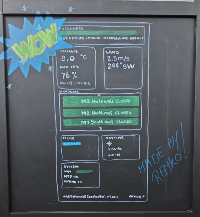
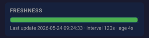
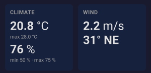
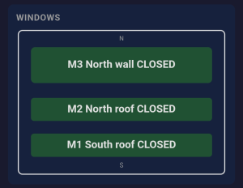
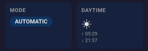
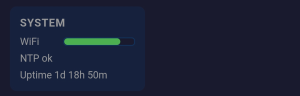
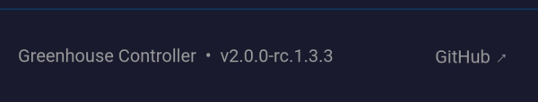

# Greenhouse Controller Statuspagina — Gebruikershandleiding

| | |
|---|---|
| Document | Gebruikershandleiding |
| Doelgroep | Operators die het publieke statusdashboard bekijken |
| Aanverwant | [functional-design.md](../design/functional-design.md) — *wat het systeem doet (intern, in het Engels)* |
| Versie | 1.0 |
| Datum | 2026-05-24 |
| Status | Beschrijft het dashboard zoals uitgerold in 2026-05 (firmware 2.0.0-a.6.35.x) |

Deze handleiding beschrijft wat u op het publieke statusdashboard ziet, en de kleuren en badges betekenen. Voorkennis van de controller of de werking van de pagina is niet nodig.

## Inhoud

1. [Waar de pagina voor dient](#1-waar-de-pagina-voor-dient)
2. [Waar u de pagina vindt](#2-waar-u-de-pagina-vindt)
3. [De pagina van boven naar beneden lezen](#3-de-pagina-van-boven-naar-beneden-lezen)
   1. [Versheid — de hartslag bovenaan](#31-versheid--de-hartslag-bovenaan)
   2. [Klimaat](#32-klimaat)
   3. [Wind](#33-wind)
   4. [Ramen](#34-ramen)
   5. [Modus](#35-modus)
   6. [Daglicht](#36-daglicht)
   7. [Systeem](#37-systeem)
   8. [Voettekst](#38-voettekst)
4. [Tooltips en hover-hulp](#4-tooltips-en-hover-hulp)
5. [De "Connection lost"-banner](#5-de-connection-lost-banner)
6. [Vervaging bij verouderde data](#6-vervaging-bij-verouderde-data)
7. [Mobiel gebruik](#7-mobiel-gebruik)
8. [Probleemoplossing — wat elke waarschuwing betekent](#8-probleemoplossing--wat-elke-waarschuwing-betekent)
9. [Privacy en toegang](#9-privacy-en-toegang)

---

## 1. Waar de pagina voor dient

De statuspagina is een **alleen-lezen web-app** op één enkele kas besturing (greenhousecontroller). Hij laat de gebruiker (of iedereen met de URL) in één oogopslag zien:

- Of de besturing regelmatig zijn status doorgeeft (de hartslag bovenaan).
- Het actuele klimaat in de kas (temperatuur, luchtvochtigheid).
- De windcondities buiten.
- De stand van elk raam/luchtraam.
- In welke bedrijfsmodus de besturing staat en of er veiligheids-, fout- of schakelalarmen actief zijn.
- Of het dag of nacht is en wanneer zonsopkomst en zonsondergang vandaag zijn.
- De gezondheid van de controller: WiFi-signaal, NTP-kloksynchronisatie, uptime sinds de laatste start, firmwareversie.

U kunt **niets** vanaf deze pagina wijzigen — er zijn geen knoppen die commando's naar de controller sturen. Alles wordt automatisch bijgewerkt; u hoeft de pagina nooit te verversen.

---

## 2. Waar u de pagina vindt

De pagina staat op de URL waarop de installateur hem heeft geplaatst. de statuspagina van de Herenboeren Wenumseveld is op het moment van schrijven:

- [https://rfsee.net/hbwv/](https://rfsee.net/hbwv/)

---

## 3. De pagina van boven naar beneden lezen

De pagina is een raster van *tegels*. Elke tegel is één op zichzelf staand stuk informatie.

De **Versheid**-tegel staat altijd bovenaan en beslaat de volle breedte van de pagina — lees deze als eerste. Alle andere tegels (Klimaat, Wind, Ramen, Modus, Daglicht, Systeem) verschijnen alleen als de controller die informatie ook daadwerkelijk doorgeeft aan de web-app. Een ontbrekende tegel betekent dat de controller die datacategorie heeft uitgeschakeld (Dit is een keuze van de operator, ingesteld op de controller zelf), niet dat er iets mis is.

### 3.1 Versheid — de hartslag bovenaan

*Figuur 1: De Versheid-tegel — groene balk, met bijschrift dat tijdstip van laatste update, interval en leeftijd toont.*

Dit is de belangrijkste tegel. Hij vertelt u of u naar live data kijkt of naar een verouderde momentopname.

**De balk** krimpt van rechts naar links naarmate de laatste update ouder wordt. De kleur verandert ook mee:

| Balkkleur | Betekenis | Drempel |
|---|---|---|
| Groen | Vers — binnen de normale rapportagecyclus van de controller | de leeftijd is ≤ 2 × interval |
| Geel / oranje | Te laat — controller is over tijd maar haalt mogelijk nog in | 2 × interval < leeftijd ≤ 4 × interval |
| Rood, met **OFFLINE**-label | Verouderd — controller heeft te lang niets doorgegeven | leeftijd > 4 × interval |

Wanneer de balk rood wordt, vervaagt de rest van het dashboard (zie [§ 6](#6-vervaging-bij-verouderde-data)) zodat duidelijk is dat u oude waarden ziet.

**Het bijschrift** onder de balk luidt:

> Last update 2026-05-24 14:30:22 · interval 30s · age 30s

- **Last update** — de volledige datum en tijd waarop de website voor het laatst een push van de controller ontving. De volledige datum wordt getoond zodat een verouderde aflezing (bijvoorbeeld van gisteren of vorige week) ondubbelzinnig is.
- **interval** — hoe vaak de controller is ingesteld om te pushen (in seconden). Als de controller dit getal niet in de payload meestuurt, valt het dashboard terug op de ingebouwde standaardwaarde en voegt `(assumed)` toe.
- **age** — hoe lang geleden die laatste update binnenkwam. Wordt weergegeven in een adaptief formaat dat meeschaalt bij langdurige onderbrekingen:

Vóórdat de controller ooit gerapporteerd heeft, leest het bijschrift `No data yet` en is de balk leeg + rood + toont **OFFLINE**.

### 3.2 Klimaat

*Figuur 2: De Klimaat- en Wind-tegels naast elkaar (zie ook § 3.3).*

Twee grote waarden plus de momenteel actieve instelpunten:

- **Temperatuur** — luchttemperatuur in de kas, in graden Celsius (één decimaal). Eronder toont een kleine, gedempte regel het momenteel actieve **maximum**-instelpunt, bijvoorbeeld `max 28 °C`. De controller kiest automatisch het dag- of nachtinstelpunt op basis van daglicht; dit is dus simpelweg het ene getal dat *op dit moment* van toepassing is.
- **Luchtvochtigheid** — actuele relatieve luchtvochtigheid als geheel percentage. De kleine regel eronder toont de momenteel actieve **min / max**-instelpunten, bijvoorbeeld `min 50 % · max 75 %`.

Als de operator de luchtvochtigheidsregeling op de controller heeft uitgeschakeld, vervaagt de instelpuntregel en wordt `min — % · max — %` getoond. Dat is normaal; het betekent dat RH-gestuurde regeling met opzet is uitgeschakeld, niet dat de sensor stuk is. De bijbehorende **Humidity ctrl off**-badge verschijnt dan ook in de Modus-tegel.

Als een sensor defect is, ziet u een **T/RH fault**-badge in de Modus-tegel in plaats van een ontbrekende waarde in de Klimaat-tegel.

### 3.3 Wind

Twee waarden:

- **Snelheid** — actuele windsnelheid in meter per seconde (één decimaal).
- **Richting** — actuele windrichting als zowel een aantal graden als een 8-punts windroos (`N`, `NE`, `E`, `SE`, `S`, `SW`, `W`, `NW`). 0° is noord, 90° is oost, enzovoort.

Als de windsensor uitvalt, ziet u een **Wind fault**-badge in de Modus-tegel.

### 3.4 Ramen

Een schematisch bovenaanzicht van de kas met drie gekleurde balken:

*Figuur 3: De Ramen-tegel — alle drie de ramen in toestand CLOSED (donkergroen). N (noord) staat aan de bovenkant van de schets, S (zuid) aan de onderkant.*

M3 (noordwand) staat bovenaan, M2 (noorddak) in het midden, M1 (zuiddak) onderaan. Het label binnen elke balk toont de ID van het raam, de naam ervan en de actuele toestand in afgekorte vorm (bijvoorbeeld `M1 South roof MOV OPEN`).

| Balkkleur | Raamstand |
|---|---|
| Donkergroen | `CLOSED` (gesloten) |
| Lichtblauw | `OPEN` (open) |
| Geel | `MOVING_OPEN` (het raam opent) of `MOVING_CLOSE` (het raam sluit zich) (getoond als `MOV OPEN` / `MOV CLOSE`) |
| Grijs | `UNKNOWN` (controller weet de stand van het raam momenteel niet) |

Hover (of houd lang ingedrukt op een aanraakscherm) op een balk om de volledige, onafgekorte toestand als tooltip te zien.

### 3.5 Modus

*Figuur 4: De Modus- en Daglicht-tegels naast elkaar (zie ook § 3.6). Hier toont het Modus-label `AUTOMATIC` zonder actieve vlag-badges; de Daglicht-tegel toont een zonsymbool met sunrise en sunset.*

Deze tegel laat twee dingen zien:

1. Een **label** met de actuele bedrijfsmodus van de controller.
2. Nul of meer **status-badges** onder het label, die veiligheids-, fout- of operatoruitschakelcondities weergeven.

**Modus-label** — kleur weerspiegelt de ernst:

| Label | Kleur | Betekenis |
|---|---|---|
| `AUTOMATIC` | Blauw (accent) | Normale automatische werking — de ramen worden geregeld door de klimaatregels. |
| `STANDBY` | Gedempt grijs | Controller is inactief — geen actieve regellus. |
| `WIND_OVERRIDE` | Geel | Hoge wind gedetecteerd — ramen zijn uit veiligheid gedwongen gesloten. |
| `WINDOW_CAL` | Geel | Raamstanden worden gekalibreerd — automatische regeling is opgeschort tot dit klaar is. |
| `MOTOR_ALARM` | Rood | Een motorstoring is gedetecteerd — automatische regeling is opgeschort tot dit klaar is. |

**Status-badges** — één per actieve status, elk gekleurd naar ernst. Rood betekent *nu actie ondernemen*, geel betekent *aandacht*, blauw betekent *de operator heeft een functie bewust uitgeschakeld*. De volledige catalogus:

| Badge | Kleur | Wat het betekent |
|---|---|---|
| `WIND` | Rood | Windsnelheid overschreed de veiligheidsdrempel; ramen gedwongen gesloten. |
| `MOTOR ALARM` | Rood | Een raammotor meldde een storing. |
| `T/RH fault` | Geel | Temperatuur-/vochtsensor geeft geen geldige data door. |
| `Wind fault` | Geel | Windsensor geeft geen geldige data door. |
| `OTA active` | Geel | Firmware- of asset-update via de lucht is bezig. |
| `Calibrating` | Geel | Kalibratie van de raamstanden is bezig. |
| `Net backoff` | Geel | Netwerk-backoff — statusuploads zijn gepauzeerd na opeenvolgende mislukkingen. |
| `Wind protect off` | Geel | De operator heeft de windbeveiliging op de controller uitgeschakeld. |
| `Humidity ctrl off` | Blauw | De operator heeft de vochtgestuurde regeling uitgeschakeld. |
| `Coredump available` | Blauw | Een crashdump van een eerdere controllerstoring staat klaar in flash. |

Wanneer het modus-label al `WIND_OVERRIDE`, `WINDOW_CAL` of `MOTOR_ALARM` toont, wordt de bijbehorende status-badge (`WIND`, `Calibrating`, `MOTOR ALARM`) onderdrukt zodat elke onderliggende toestand precies één keer zichtbaar is.

### 3.6 Daglicht

Geeft aan of het volgens de controller op dit moment dag of nacht is, plus het tijdstip waarop de zon op komt of onder gaat vandaag:

- Zonsymbool (☀) voor dag, maansymbool (☾) voor nacht.
- `↑ HH:MM` — zonsopkomsttijd vandaag, lokale klok.
- `↓ HH:MM` — zonsondergangtijd vandaag, lokale klok.

Tijden zijn lokale tijd, door de controller voor zomertijd gecorrigeerd. Ze sturen de dag/nacht-keuze van de controller voor instelpunten aan.

### 3.7 Systeem

*Figuur 5: De Systeem-tegel met WiFi-signaalbalk (groen = goed), NTP-status en uptime.*

Gezondheid van de controller, drie rijen van boven naar beneden:

1. **WiFi** — horizontale signaalsterktebalk. Groen = goed (≥ −54 dBm), geel = matig (≥ −72 dBm), rood = zwak (daaronder). Hover voor het dBm-getal en de kwaliteitsaanduiding.
2. **NTP** — `NTP ok` wanneer de klok van de controller is gesynchroniseerd met netwerktijd; `NTP pending` wanneer dat nog niet zo is.
3. **Uptime** — verlopen tijd sinds de laatste start van de controller.

### 3.8 Voettekst

*Figuur 6: De voettekst onderaan de pagina, met firmwareversie en GitHub-link.*

Onderaan de pagina:

- `Greenhouse Controller · v<firmwareversie>` — de software versie van de controller. Als u ooit hulp moet vragen aan de beheerder, vermeld dan deze waarde.
- Een link naar de GitHub-repository van het project (opent in een nieuw tabblad).

---

## 4. Tooltips en hover-hulp

Elk label, elke waarde en elke badge heeft een hover-tooltip (`title`-attribuut). In een desktopbrowser hovert u met de muis voor de toelichting. Op een aanraakapparaat brengt een lange aanraking meestal dezelfde tekst naar voren, afhankelijk van de browser.

Voorbeelden:
- Hoveren over de WiFi-balk geeft het dBm-getal en de kwaliteitsaanduiding.
- Hoveren over een raambalk toont de onafgekorte toestandsnaam.
- Hoveren over een vlag-badge geeft een uitgebreidere beschrijving van de conditie.

Als u zich ooit afvraagt "wat is dit getal?" — de tooltip is het eerste om te raadplegen.

---

## 5. De "Connection lost"-banner

Een rode banner bovenaan de pagina met de tekst `Connection lost` verschijnt wanneer de **browser** de website drie opeenvolgende keren niet kan bereiken. Polling vindt elke vijf seconden plaats, dus de banner verschijnt ongeveer 15 seconden na een netwerkonderbreking.

Wat u moet weten:

- Dit duidt op een probleem tussen *uw browser en de website*, niet noodzakelijk tussen de website en de controller.
- De controller kan nog steeds vrolijk doorrapporteren.
- Zodra de browser de website weer kan bereiken, verdwijnt de banner en hervat de pagina de normale updates.

Wanneer de banner zichtbaar is, vertrouw geen enkele waarde op de pagina — ze zijn bevroren bij de laatste succesvolle poll.

---

## 6. Vervaging bij verouderde data

Wanneer de Versheid-balk rood wordt (leeftijd > 4 × interval), vervaagt de rest van het dashboard tot ongeveer 55% dekking. Dit is een visuele aanwijzing dat de waarden die u leest niet meer vers zijn; alleen de Versheid-tegel zelf blijft helder, omdat dat de enige tegel is waarvan de eigen toestand nog betekenisvol is (hij vertelt u *hoe* verouderd).

Wanneer de controller weer gaat pushen, wordt de vervaging automatisch ongedaan gemaakt bij de eerstvolgende succesvolle poll.

---

## 7. Mobiel gebruik

Het dashboard is ontworpen vanuit de mobiele weergave. Op een telefoon:

- De Versheid-tegel beslaat de volle breedte.
- De Ramen-tegel beslaat de volle breedte (zodat de drie balken leesbaar blijven).
- De overige tegels vloeien in één kolom.
- Tikdoelen (downloadknoppen, GitHub-link) zijn op vingerformaat.
- Tooltips werken in de meeste browsers nog steeds via lang indrukken.

De pagina is alleen-lezen en vereist geen inlog, dus een snelle blik op de telefoon is een normaal gebruiksscenario.

---

## 8. Probleemoplossing — wat elke waarschuwing betekent

Snelle naslag voor de meest voorkomende dingen die er "niet goed" uitzien:

| Wat u ziet | Wat er aan de hand is |
|---|---|
| Versheid-balk rood, OFFLINE-label, alles vervaagd | Controller heeft niet meer gepusht in > 4× interval. |
| Versheid geel, verder normaal | Eén of twee updates waren te laat. Herstelt vaak bij de volgende push. |
| Bijschrift leest `No data yet` | Website heeft sinds uitrol nog nooit een push ontvangen (of het opgeslagen statusbestand is gewist). |
| Bijschrift toont interval als `(assumed)` | Controller heeft `update_interval_s` niet in de payload meegestuurd. Het dashboard viel terug op zijn standaard. |
| `Connection lost`-banner | Browser kan de website niet bereiken. |
| `MOTOR ALARM`-badge / modus-label | Een raammotor meldde een storing. |
| `WIND`-badge / `WIND_OVERRIDE`-label | Windveiligheid heeft de ramen gedwongen gesloten. |
| `T/RH fault`- of `Wind fault`-badge | Een sensor geeft geen geldige data door. |
| `Wind protect off`-badge | Windbeveiliging is **uitgeschakeld** door de operator. |
| `Humidity ctrl off`-badge + gedempte RH-instelpunten | Vochtgestuurde regeling is **uitgeschakeld** door de operator. |
| `OTA active`-badge | Een firmware-/asset-update is bezig. |
| `Calibrating`-badge / `WINDOW_CAL`-label | Kalibratie van de raamstanden loopt. |
| `Net backoff`-badge | Uitgaand netwerk van de controller faalt; hij vertraagt zijn pogingen. |
| `Coredump available`-badge | Een crashdump staat in het flashgeheugen van de controller. |
| Raambalk is grijs (`UNKNOWN`) | Controller weet de stand van dat raam momenteel niet. |
| WiFi-balk is rood | WiFi-signaal van de controller is zwak. |
| `NTP pending` | Controller heeft zijn klok nog niet met netwerktijd gesynchroniseerd. |
| Uptime plotseling kort | Controller is recent herstart. |

Als geen van het bovenstaande past bij wat u ziet, deel dan de **firmwareversie** uit de voettekst en een screenshot met de beheerder.

---

## 9. Privacy en toegang

Het dashboard is **alleen-lezen en publiek toegankelijk** — iedereen met de URL kan het zien. Er is geen inlog vereist.

- Er zijn geen besturingselementen op de pagina die commando's versturen.
